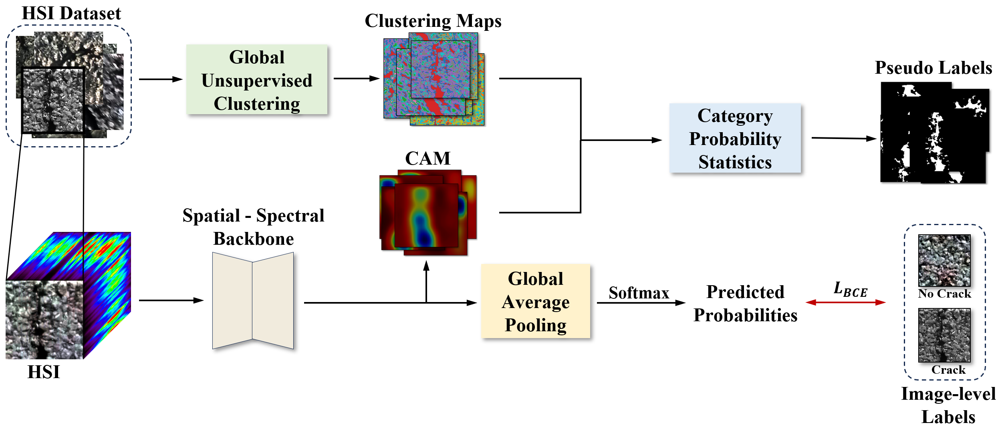

# Road Crack Segmentation From Hyperspectral Images Based On Image-Level Annotations

___________

The code in this toolbox implements the "Road Crack Segmentation From Hyperspectral Images Based On Image-Level Annotations". 

More specifically, it is detailed as follow.

How to use it?
---------------------
1. Download HSI datasets with image-level labels and pixel-level labels.

2. Run the code in sequence according to the serial numbers at the beginning of the code files.

Others
----------------------
We used the spatial-spectral network proposed in ["A multiscale enhanced pavement crack segmentation network coupling 
spectral and spatial information of UAV hyperspectral imagery"](https://doi.org/10.1016/j.jag.2024.103772)   when training CAM and the crack segmentation model. The model can be obtained at https://github.com/williamchen-x/MS-CrackSeg.

